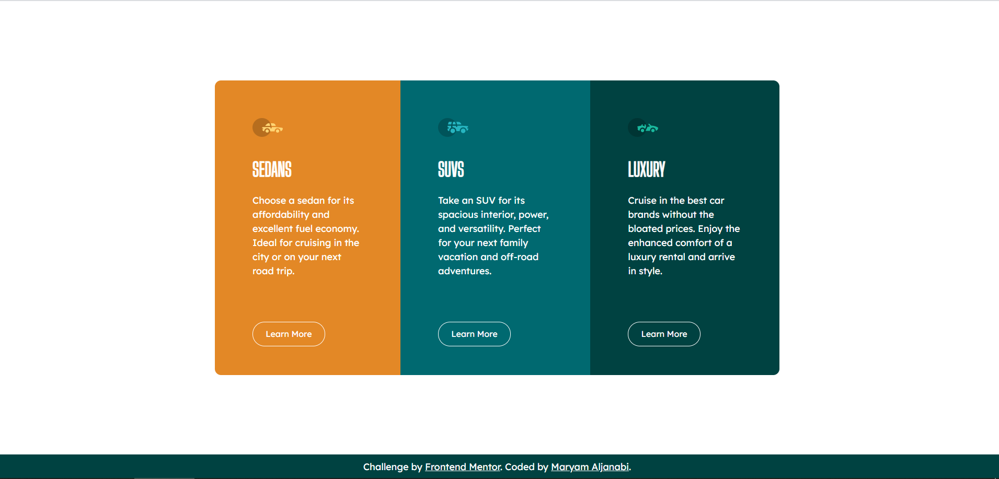

## Table of contents

- [Overview](#overview)
- [The challenge](#the-challenge)
- [Screenshot](#screenshot)
- [Demo](#demo)
- [Built with](#built-with)
- [Author](#author)

## Overview

This is a solution to the [3-column preview card component challenge on Frontend Mentor](https://www.frontendmentor.io/challenges/3column-preview-card-component-pH92eAR2-).

## The challenge

Users should be able to:

- View the optimal layout depending on their device's screen size
- See hover states for interactive elements

## Screenshots

Desktop version

Mobile

## Demo

The solution is deployed to github pages and can be viewed through this URL: [Solution on Github Pages](https://maryamaljanabi.github.io/frontend-mentor-3column/)

## Built with

- HTML
- CSS
- SASS

## Author

- [Maryam Aljanabi](https://github.com/maryamaljanabi)
